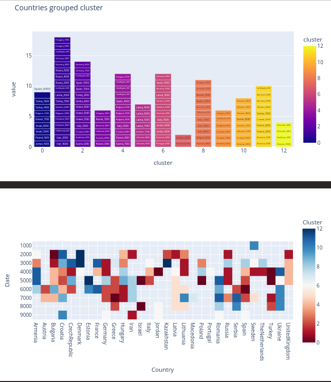

## Project

Develop an interface that allows selecting **populations** and **time** and calculates the **minor allele frequencies** of the chosen populations . The program will **merge patterns** that are too close. The results will be printed on the screen.

## Approach

I divide the project to three steps:

1. **Data Preprocessing** : convert fam,bim,bed to a format that can be used in the next steps. `1_raw2freq.ipynb`

   - Ideal format:`Country(Sweden), Date(2000), MAF for SNP1, MAF for SNP2, MAF for SNP3, ...`
2. Unsupervised **Clustering** : To merge patterns that are too close. With such a high featured small dataset, clustering is a nightmare. However, I find Spectral Clustering better than K-means. TSNE and UMAP have been used for comparison. The other option would be gussian mixture model.`2_clustring.ipynb`
3. **Web Interface** : Using **streamlit** to create a web interface that allows selecting **populations** and **time** and clustring the data.`app.py` and `my_functions.py`

# Result

[App link is here](https://gpsmaf.streamlit.app/ "Geographic Population Structure (GPS) Based on Minor Allele Frequencies (MAF) of SNPs")



## Setup

### Data

```

Data/── 0_Raw

        ├── DataS1.bim

        ├── DataS1.fam

        ├── DataS1.log

        └── Eurasian - Dataset_tims.xlsx

```

### Code

```
./
├── 1_raw2freq.ipynb

├── app.py

├── my_functions.py

├── requirements.txt


```

### Instructions

You can find the detailed instructions in the notebooks.

## PLINK 1.9

[PLINK](https://www.cog-genomics.org/plink/1.9/) is a free, open-source whole genome association analysis toolset, designed to perform a range of basic, large-scale analyses in a computationally efficient manner. The focus of PLINK is purely on analysis of genotype/phenotype data, so there is no support for a file format for storing sequence data or working with the sequence data directly.

[*More...*](https://zzz.bwh.harvard.edu/plink/)

[*Tutorial*](https://zzz.bwh.harvard.edu/plink/tutorial.shtml)

**_Installation_**

```bash

conda install-c bioconda plink

```

ver: plink-1.90b6.21

converting the data to ped format

```bash


plink --bfile DataS1 --maf  0.01  --recode   --out  s1


```
