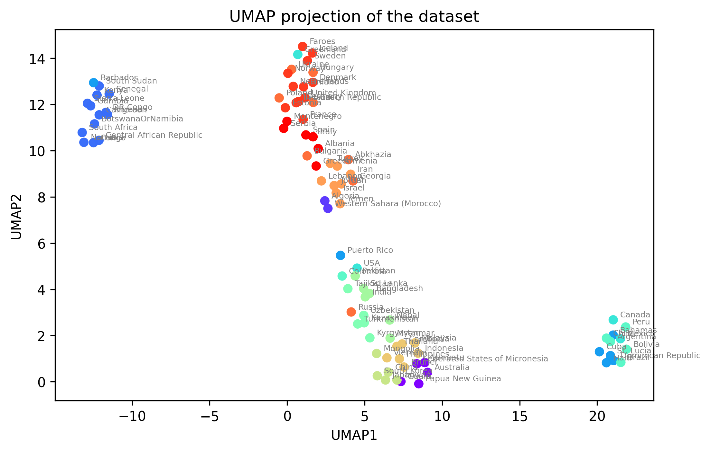
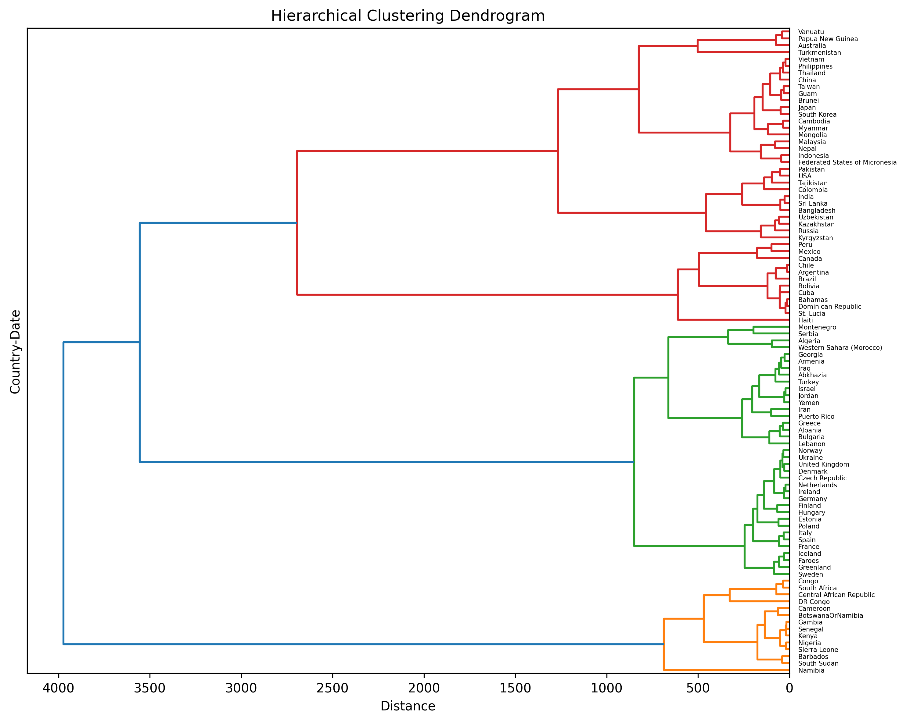

# GPSmaf v2.0
|        |         |
|-------------------|-------------------|
|  |  |


## **Objective:**

Develop an interface that allows selecting populations and time. The program will merge patterns that are too close based on the minor allele frequencies of the chosen populations. The results will be printed on the screen.


## **Description:**

This repository provides a pipeline for handling and analyzing ancient genetic data and infrence genetical relationship between samples through the ages. It covers various stages, including PLINK file parsing, missing data filtering, Minor Allele Frequency (MAF) calculation, clustering analysis, and dimensionality reduction using an ensemble of autoencoders. Additionally, it offers visualization tools for exploring the data in reduced-dimensional space and hierarchical clustering. The pipeline is implemented in Python and is available as a Docker image. The pipeline is also available as a Streamlit app. The app allows users to select populations and time and visualize the results.  The app is available at https://gpsmaf.streamlit.app/.


## **Sections:**

- [Data Processing and Methodology](Notes/Methods_describtion.md): Describes the data processing and methodology.
- [Results](Writings/Arash_Darzian.pdf): Report of the project.


## **Data:**

- [Input Data: Plink files of Ancient DNA Samples ](Data/Input/description.txt)
- Output Data: `Data/Output`
  - `0_country_date_MAF.csv.gz`: contains the MAF for each SNP within each "country_date" group.
  - `1_encoded_data_frame.csv.gz`: contains the encoded data frame for each "country_date" group.


## **Scripts:**

*Scripts_notebooks/*: contains the scripts and notebooks for the pipeline.

- `0_plink_to_countryDate_MAF.ipynb` : Parsing PLINK files and calculating MAF. Need near 500 GB of RAM to run.
- `1_clustring.ipynb` : Clustering analysis and visualization
- `GPSmaf_streamlit_app.py `: Streamlit app for the interface.


## **Implementation** 

### **`Docker Implementation`** 

Download the repository and follow the following steps to run the streamlit app in a docker container.

1- install Docker

Make sure Docker is installed, otherwise you need to google &quot;how to install docker&quot; or check this page (https://docs.docker.com/engine/install/centos/). 

! please note that regarding your access you may run folowing code with sudo or without sudo command.

2- Build the image

Docker file is provided in the repository. To build the image, run the following command in the terminal:

``` console
> docker build -t gps-image . #(the dot is important)
```
 
3- Run the container with port forwarding
``` console
> docker run -itd --name gps-container -p 8501:8501 gps-image # (to run in detached mode)
```
The above command outputs the container id. Copy it and paste it in the following command

``` console
> docker attach <docked-id> #(to attach to the container)
```

4- Run Streamlit

Now you are inside the container. Run the following command to run the streamlit app
with port forwarding

``` console
> streamlit run --server.port 8501 Scripts_notebooks/GPSmaf_streamlit_app.py
```


5- Click on the link below to open the app in your default browser

http://localhost:8501/


6- Stop and remove the container and image

``` console
> docker ps #(to see the running containers)

> docker stop <name or id> #(to stop the container)

> docker rm <name or id> #(to remove the container)

> docker images #(to see the images)

> docker rmi <name or id> #(to remove the image)
```


### **`Other Implementation`**

Installing a Conda Environment using environment.yml

- Install Conda: Download and install Miniconda or Anaconda.

- Create Project Directory: Set up a project directory and navigate to it.

- Activate Base Environment: Run `conda activate base`.

- Create Environment: Use `conda env create -n gpsmaf -f conda_environment.yml`.

- Wait for Installation: Wait for Conda to install the required packages.

- Activate Environment: Activate the "gpsmaf" environment with `conda activate gpsmaf`.

- Start streamlit: run `streamlit run Scripts_notebooks/GPSmaf_streamlit_app.py`


### **`Streamlit Server Implementation`**

- I linked the repository to the streamlit server. So, it can be accessed through the following link:
- 
Link : https://gpsmaf.streamlit.app/

-`requirements.txt` : contains the required packages for the streamlit server.


## How to cite this repo

Darzian, Arash. "Geographic Population Structure (GPS)." GitHub, 2023, [https://github.com/arash-darzian/Geographic_Population_Structure_GPS](https://github.com/arash-darzian/Geographic_Population_Structure_GPS).


